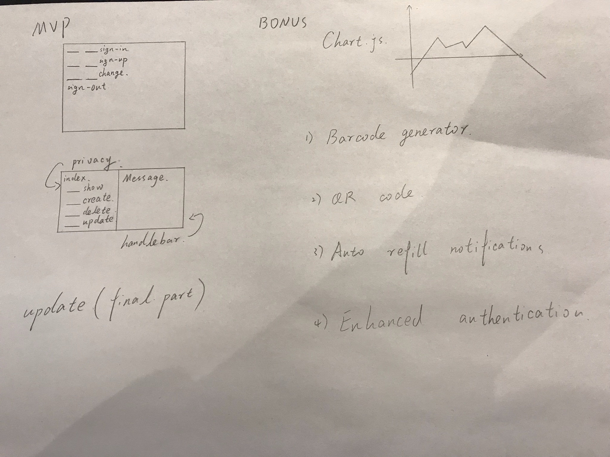

<h1>Inventory Management</h1>

<h4>This application allows users to track their inventory levels of various items for their business needs.</h4>

<h4>Important Links</h4>

- https://ga-unauthorized.github.io/inventory-client/
- https://github.com/ga-unauthorized/inventory-client
- https://github.com/ga-unauthorized/inventory-api
- https://quiet-oasis-34691.herokuapp.com/

<h4>Technologies Used</h4>
<ul>
<li>HTML</li>
<li>CSS</li>
<li>JavaScript</li>
<li>jQuery</li>
<li>DOM</li>
<li>Handlebars</li>
<li>Bootstrap</li>
<li>AJAX</li>
<li>GitHub</li>
<li>MongoDB</li>
<li>Mongoose</li>
<li>Express</li>
</ul>

<h4>Document Planning</h4>
  

  We began project three by doing a bit of research on working in groups. By focusing on some of the key elements of the scrum framework, we were better able to orient ourselves as a team for this project. As a team, we appointed a scrum master as well as scheduled daily standup meetings to lay the groundwork and foundation for each day.

  Next, we began by building the backend framework of our Inventory Management program, using MongoDB, Mongoose, and Express. We split up the backend responsibilities into two main components and worked in pairs to complete the model and routes for our inventory item database. Finally, we set up a relationship between the user and an inventory item, to satisfy the project requirement for one resource (inventory item) having a relationship to the user.

  Once the backend was set up and running, we moved onto the client application for our Inventory Management application. By splitting up the responsibilities into smaller, more manageable pieces, we were able to cover more ground, while also gaining some much needed experience with rebasing, merging, and pulling our work on GitHub.

  We split up the front-end work into four main components: authentication, CRUD actions (on items), HTML, and handlebars/css. Each team member worked through their respective assignments and raised questions to the other members of the group as needed. By breaking up the workload according to functionality and feature, we were able to work on separate branches and keep our code more modular, thus avoiding an excess of merge conflicts.

  For both authentication and CRUD actions, we used curlscipts to test. Once the curlscripts were successful across all fronts, we added web page functionality for a user to be able to sign-up/sign-in/change password/sign-out as well as create, update, view (one and all items), and delete an item.

  Finally, on the third and final day of the project, with our MVP requirements met, we embarked on putting some finishing touches on our project. Some of us focused on strech goals (ie. adding QR codes to each inventory item), while others worked through adding bootstrap styling effects to the front-end.

  This team project was both challenging and insightful. We learned so much about working in isolation vs. working in a team. We gained a good amount of experience merging, rebasing, and pulling on GitHub as well as breaking up work by functionality and feature. For what we accomplished in three days, we are very proud of our efforts, newly acquired programming knowledge and final product!
  

<h4>User Stories</h4>
<ul>
<li>As an unregistered user, I would like to sign up with email and password.</li>
<li>As a registered user, I would like to sign in with email and password.</li>
<li>As a signed in user, I would like to change password.</li>
<li>As a signed in user, I would like to sign out.</li>
<li>As a signed in user, I would like to create an inventory item.</li>
<li>As a signed in user, I would like to update my inventory items.</li>
<li>As a signed in user, I would like to delete my inventory items.</li>
<li>As a signed in user, I would like to see all items.</li>
<li>As a signed in user, I would like to see the quantity and price of each item.</li>
<li>As a signed in user, I want to be able to update or create inventory without having to know what my current inventory levels are.</li>
</ul>

<h4>Wireframes</h4>

<h4>Unsolved Problems</h4>

